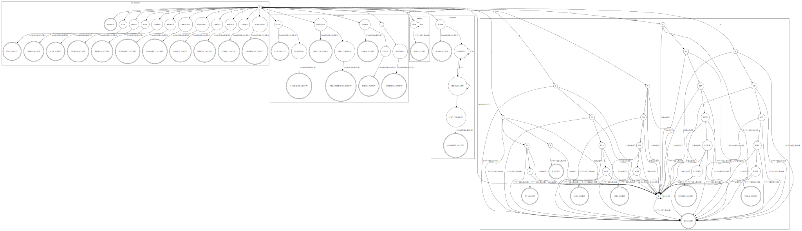

# Regex for each token

1. ELSE

    else

2. IF

    if

3. INT

    int

4. RETURN

    return

5. VOID

    void

6. WHILE

    while

7. PLUS

    -

8. MINUS

    -

9. STAR

    -

10. SLASH

    /

11. LPAREN

    (

12. RPAREN

    )

13. LBRACKET

    [

14. RBRACKET

    ]

15. LBRACE

    {

16. RBRACE

    }

17. COMMA

    ,

18. SEMICOLON

    ;

19. LESS

    <

20. GREATER

    \>

21. EQUAL

    =

22. NOTEQUAL

    !=

23. ASSIGN

    =

24. LESSEQUAL

    <=

25. GREATEREQUAL

    \>=

26. ID

    [a-zA-Z][a-zA-Z0-9]\*

27. NUM

    [0-9]+

28. BLANK

    [\s|\t|\n]\*

29. COMMENT

    \\\/\\\*[^\\\*]\*(\\\*[^\\\*]\*)\*\\\*\\\/

30. ENDFILE

    $

# Definite Finite Automata

