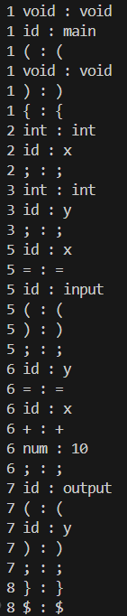
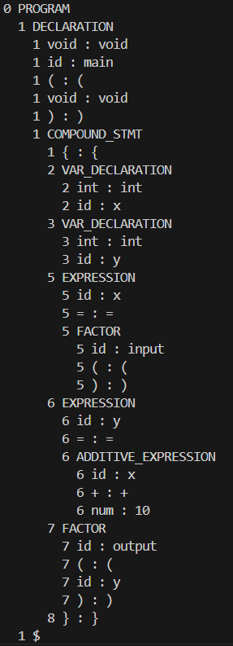
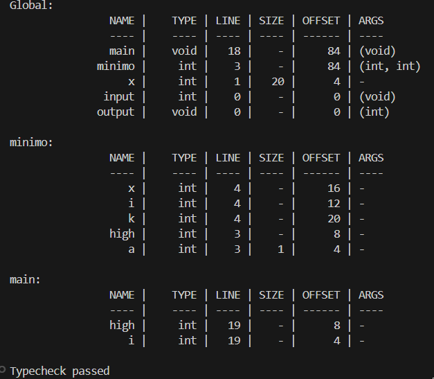
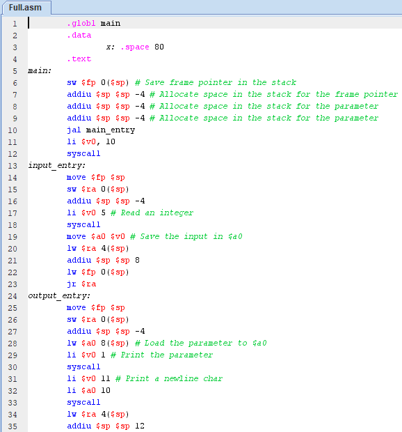

# Compiler for Simple Programming Language (C--)

This project implements a compiler for a simple programming language called "C--". The compiler takes a source file as input and generates a MIPS assembly code file, and optionally outputs the lexer, parser, and symbol table.

MIPS was selected as the target architecture for the compiler because it is a simple and well-known architecture that can be easily implemented.

The assembly code generated by the compiler can be easily executed on a computer with a MIPS processor or a MIPS emulator, such as [MARS](https://dpetersanderson.github.io/).

## Build Instructions

Make sure you have `g++` installed. Then, in the project directory:

```bash
make
```

## Usage

```bash
./compiler.exe <source_file> [output_file] [-lps]
```

-   `<source_file>`: The input source file to be tokenized.
-   `[output_file]`: The (optional) output file for the generated assembly code.
-   `-l`: Print lexer output.
-   `-p`: Print parser output.
-   `-s`: Print symbol table.

If no output file is specified, the assembly code will be written to `Outputs/<source_file>.asm`.

Once the compiler is executed, the assembly code will be written to the specified output file or the default file.

From there you can execute the assembly code on a computer with a MIPS processor or a MIPS emulator, such as [MARS](https://dpetersanderson.github.io/).

## Examples

```bash
./compiler.exe Tests/Simple.c--
./compiler.exe Tests/Full.c-- Outputs/output.asm -lps
```

### Output Images

#### Lexer



#### Parser



#### Symbol Table



#### Assembly Code



## Features

### Lexer

The lexer performs the following tasks:

-   Recognizes keywords like `if`, `else`, `int`, `return`, `void`, `while`
-   Supports basic punctuation and operators (`+`, `-`, `*`, `/`, `==`, `!=`, `<=`, etc.)
-   Handles C-style comments (`/* ... */`)
-   Reports invalid tokens with line and column indicators
-   Can output the token stream

### Parser

-   Generates an abstract syntax tree (AST) from the token stream
-   Reports syntax errors with line indicators
-   Can output the AST

### Semantic Analysis

-   Symbol Table Generation
-   Type Checking
-   Can output the symbol table

### Code Generation

-   Generates MIPS assembly code for the AST
-   Can output the assembly code to a file

## Error Handling

Each error is reported with a line number and error message.

## Cleanup

To remove the compiled binary:

```bash
make clean
```

To remove all generated files:

```bash
make fclean
```

## Contributors

-   [Mario Ignacio Frias Piña](https://github.com/MarioFriasPina)
    -   A01782559

## License

This project is distributed under the [MIT License](https://opensource.org/licenses/MIT).
